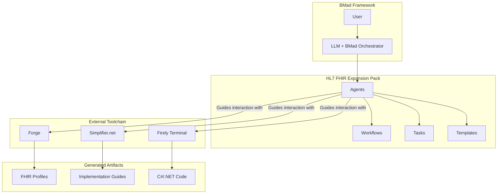
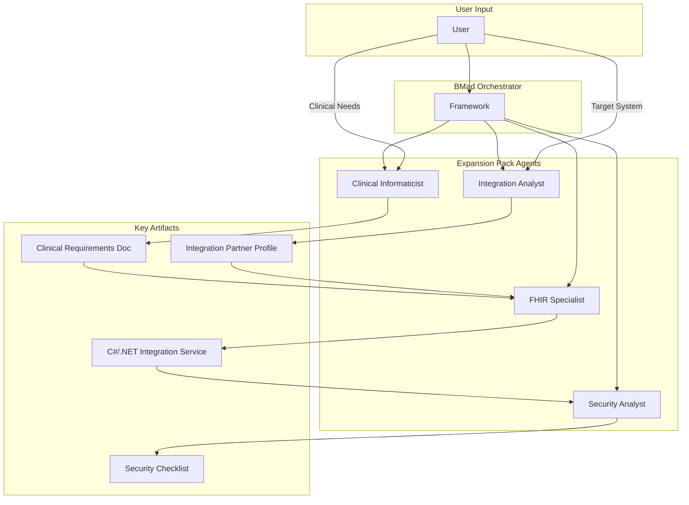
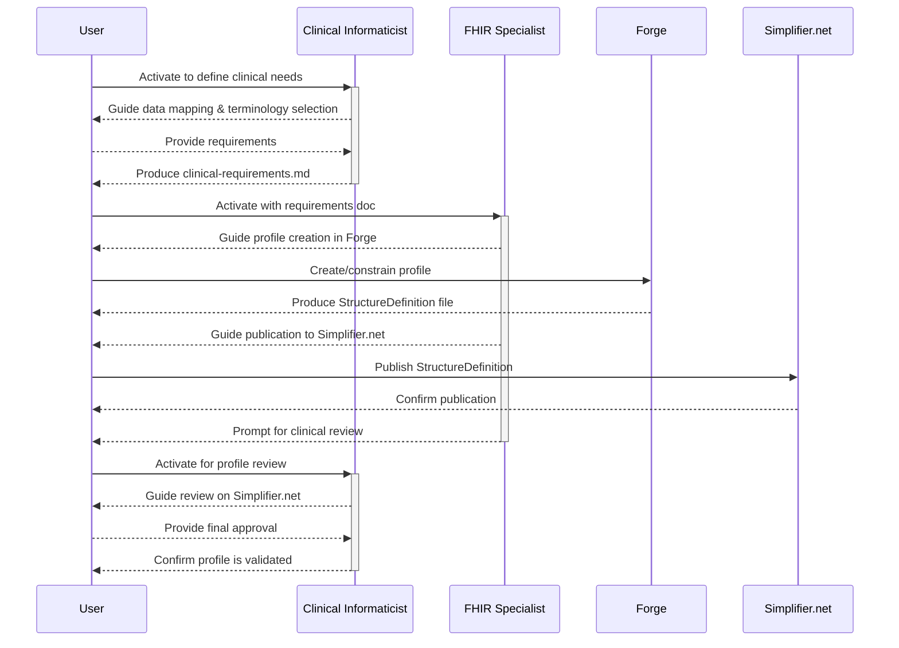
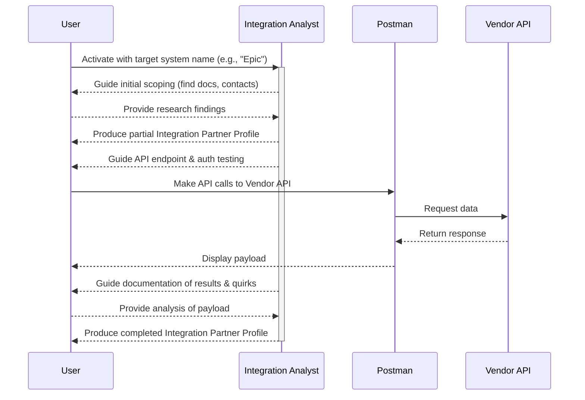
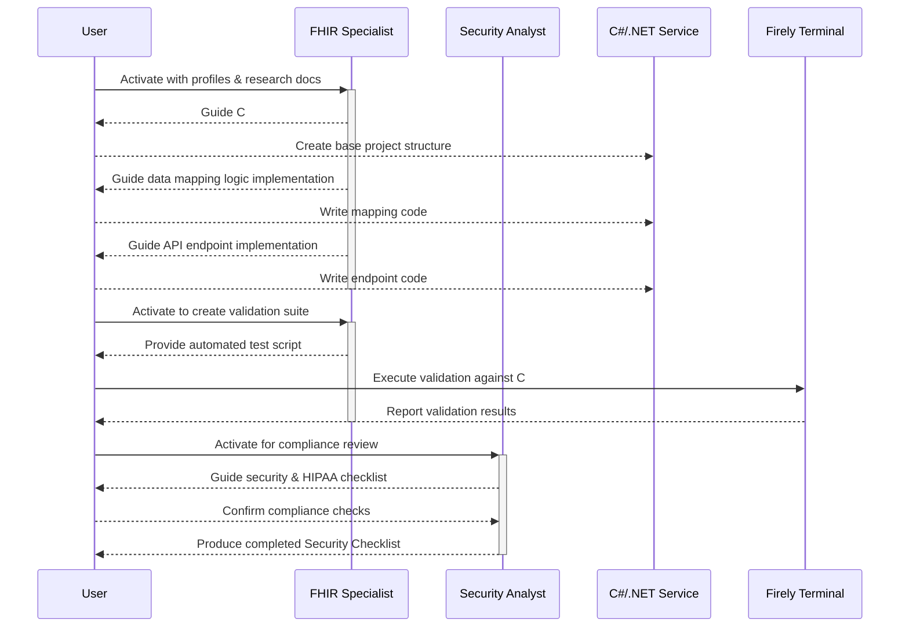

# Architecture Document: HL7 FHIR Integration Expansion Pack

## Section 1 of 12: Introduction

This document outlines the overall project architecture for the HL7 FHIR Integration Expansion Pack, including its internal structure, components, and the architectural patterns for the code it will generate. Its primary goal is to serve as the guiding architectural blueprint for AI-driven development, ensuring consistency and adherence to chosen patterns and technologies.

### Starter Template or Existing Project

This project will be built using an existing BMad expansion pack as a foundational template. This approach will accelerate development by providing a pre-configured file structure and component organization that aligns with BMad best practices. The specific structure will be detailed in the "Source Tree" section of this document.

### Change Log

| Date       | Version | Description              | Author            |
|------------|---------|-------------------------|-------------------|
| 2025-09-15 | 1.0     | Initial Architecture Draft | Winston (Architect) |

---

## Section 2 of 12: High Level Architecture

### Technical Summary

The HL7 FHIR Integration Expansion Pack is architected as a standard BMad file-based system, comprising a suite of specialized AI agents, workflows, tasks, and templates defined in Markdown and YAML. Its core function is to orchestrate the Firely toolchain and guide the generation of C#/.NET integration code. The architecture follows the BMad agent-driven pattern, where each AI persona encapsulates specific domain expertise. This component-based approach directly supports the PRD's primary goal of accelerating healthcare integration by providing a structured, automated framework for developers.

### High Level Overview

- **Architectural Style:** This is a BMad Standard File-Based Architecture. It is not a runnable application itself, but a collection of configuration files that give "life" to AI agents within the BMad framework.
- **Repository Structure:** As defined in the PRD, this will be a Monorepo. This structure is ideal for managing the interconnected components (agents, tasks, templates) of an expansion pack.
- **Interaction Flow:** A user will interact with a BMad-enabled LLM, load the expansion pack, and activate one of the specialized agents. The agent will then use its defined workflows, tasks, and templates to guide the user through a specific process, such as creating a FHIR profile or researching a vendor's API.

### High Level Project Diagram



### Architectural and Design Patterns

- **Agent-Based Architecture:** The core of the solution. This pattern allows us to encapsulate complex, domain-specific knowledge into manageable, reusable AI personas (e.g., Clinical Informaticist).  
  *Rationale:* Mirrors a real-world expert team, making the user's interaction intuitive.
- **Workflow Pattern:** The primary execution model for agents. Workflows define the step-by-step process for complex goals like "Specification & Profiling."  
  *Rationale:* Provides a structured, repeatable process that reduces errors and cognitive load for the developer.
- **Template Method Pattern:** The use of `.tmpl` files for generating standardized documents and code.  
  *Rationale:* Ensures consistency, enforces best practices, and automates the creation of repetitive artifacts like FHIR profiles and security policies.

---

## Section 3 of 12: Tech Stack

This section defines the definitive technology stack for both the expansion pack itself and the integration services it will generate. These choices are derived directly from the PRD's technical assumptions and are considered the single source of truth for all development. All AI agents will be constrained to use these specific technologies and versions.

| Category                | Technology         | Version    | Purpose                                               | Rationale                                                                                 |
|-------------------------|-------------------|------------|-------------------------------------------------------|-------------------------------------------------------------------------------------------|
| Language (Generated Code) | C#                | 12         | Primary language for generated integration services.   | Directly aligns with the Firely .NET SDK, providing seamless integration and strong typing for healthcare data models. |
| Runtime (Generated Code)  | .NET              | 8.0 (LTS)  | Executes the generated C# code.                       | Current Long-Term Support (LTS) version, ensuring long-term support, performance, and stability. |
| Framework (Generated Code)| ASP.NET Core      | 8.0        | To build the web APIs for the integration services.    | The standard, high-performance framework for building web APIs with C#/.NET.              |
| Core SDK (Toolchain)      | Firely .NET SDK   | 5.x        | Core library for parsing, validating, and interacting with FHIR resources. | A non-negotiable core dependency defined by the project's goals.                          |
| Dev Tools (Toolchain)     | Forge, Simplifier.net, Firely Terminal | Latest | Profiling, collaboration, and validation.              | The core external tools the expansion pack is designed to orchestrate.                    |
| API Standard              | HL7 FHIR          | R4         | The data interchange standard.                        | The specified version for healthcare interoperability.                                    |
| Authorization Standard    | SMART on FHIR     | v2         | Secure, user-consented access to clinical data.       | The industry standard for FHIR app authorization.                                         |
| Pack Definition Language  | Markdown, YAML    | N/A        | Defining agents, workflows, tasks, and templates.     | The standard for the BMad framework.                                                      |

---

## Section 4 of 12: Data Models

These are the conceptual data models that define the structure of the expansion pack itself. They are not database schemas but rather the high-level information structures that the BMad framework uses to understand and operate the agents.

### AgentConfiguration (.md)

- **Purpose:** To define the persona, capabilities, and dependencies of a single AI agent. This model corresponds directly to an agent's markdown file.
- **Key Attributes:**
  - `id`: string - The unique identifier for the agent (e.g., "clinical-informaticist").
  - `name`: string - The human-friendly name of the agent.
  - `persona`: object - A structured object containing the agent's role, style, and core principles.
  - `dependencies`: object - Lists of tasks, templates, and workflows the agent is authorized to use.

### WorkflowDefinition (.yaml)

- **Purpose:** To define a multi-step, sequential process that an agent can guide a user through.
- **Key Attributes:**
  - `id`: string - The unique identifier for the workflow (e.g., "specification-workflow").
  - `name`: string - The human-friendly name of the workflow.
  - `sequence`: array - An ordered list of steps, defining the agents and tasks involved in the process.

### TaskDefinition (.md)

- **Purpose:** To define a single, atomic, and repeatable action an agent can perform.
- **Key Attributes:**
  - `id`: string - The unique identifier for the task (e.g., "create-fhir-profile").
  - `description`: string - A detailed description of the task's objective and method.
  - `inputs`: object - The required inputs for the task (e.g., a clinical requirements document).
  - `outputs`: object - The expected artifacts produced by the task (e.g., a FHIR StructureDefinition file).

### TemplateDefinition (.yaml or .md)

- **Purpose:** To define a reusable, standardized artifact, such as a document or a piece of code, that agents can use to generate consistent outputs.
- **Key Attributes:**
  - `id`: string - The unique identifier for the template.
  - `format`: string - The output format (e.g., "markdown", "csharp").
  - `structure`: object - The content and placeholder variables for the template.

---

## Section 5 of 12: Components

This section breaks down the expansion pack into its primary logical components. The core components are the specialized AI agents themselves, each with a distinct set of responsibilities and interfaces (tasks).

### Component: FHIR Interoperability Specialist Agent

- **Responsibility:** The technical implementation of FHIR standards. This agent translates clinical requirements and vendor specifications into compliant FHIR artifacts and functional C#/.NET code.
- **Key Interfaces:** `generate-scaffolding`, `implement-data-mapping`, `implement-api-endpoint`, `create-validation-suite`.
- **Dependencies:** Consumes `clinical-requirements.md` from the Informaticist and the Integration Partner Profile from the Integration Analyst.

### Component: Clinical Informaticist Agent

- **Responsibility:** Serving as the clinical subject matter expert. This agent translates healthcare needs and data context into formal technical requirements.
- **Key Interfaces:** `document-clinical-requirements`, `review-simplifier-profile`.
- **Dependencies:** Consumes direct input from the user regarding clinical needs.

### Component: Healthcare IT Security and Compliance Analyst Agent

- **Responsibility:** Ensuring the integration meets all regulatory (e.g., HIPAA) and security standards.
- **Key Interfaces:** `conduct-security-assessment`.
- **Dependencies:** Consumes the completed and implemented integration service for its review.

### Component: Healthcare System Integration Analyst Agent

- **Responsibility:** Researching and documenting the technical specifics of target vendor systems.
- **Key Interfaces:** `initial-scoping`, `technical-research`, `document-quirks`.
- **Dependencies:** Consumes user input (target system) and external vendor documentation.

### Component Interaction Diagram



---

## Section 6 of 12: External APIs

This expansion pack does not directly call external APIs in a traditional runtime sense. Instead, its primary architectural function is to orchestrate the user's interaction with an external toolchain and to generate code that will, in turn, interact with EHR vendor APIs. The following are the key external systems this pack is designed to manage:

1. **Simplifier.net**  
   - *Purpose:* The central, cloud-based repository for collaborative FHIR project management, profile publishing, and documentation.  
   - *Responsible Agents:* FHIR Interoperability Specialist, Clinical Informaticist.  
   - *Interaction Method:* The agents provide step-by-step guidance for the user to perform actions (e.g., "publish profile," "review comments") via the Simplifier.net web interface.

2. **Forge FHIR Profile Editor**  
   - *Purpose:* The desktop application used for the technical creation and validation of FHIR profiles (StructureDefinitions).  
   - *Responsible Agent:* FHIR Interoperability Specialist.  
   - *Interaction Method:* The agent provides a detailed, guided workflow for the user to operate the Forge desktop application.

3. **Firely Terminal**  
   - *Purpose:* The command-line tool used for scripting, batch validation of FHIR resources, and package management.  
   - *Responsible Agents:* FHIR Interoperability Specialist, Healthcare System Integration Analyst.  
   - *Interaction Method:* The agents generate and provide specific command-line scripts for the user to execute in Firely Terminal.

4. **Target EHR Vendor FHIR APIs (e.g., Epic, OpenEMR, Eyefinity)**  
   - *Purpose:* These are the ultimate targets of the integration service.  
   - *Responsible Agents:* Healthcare System Integration Analyst (for research), FHIR Interoperability Specialist (for implementation).  
   - *Interaction Method:* The agents guide the generation of C#/.NET code that will make live RESTful API calls to these external systems.

---

## Section 7 of 12: Core Workflows

This section visualizes the primary operational sequences of the expansion pack using Mermaid sequence diagrams. These diagrams illustrate the step-by-step collaboration between the user and the specialized AI agents to achieve the project's key objectives.

### Workflow 1: Specification & Profiling

This workflow details the process of creating a new, clinically validated FHIR profile.



### Workflow 2: Integration Research

This workflow shows how the Integration Analyst researches a target vendor system.



### Workflow 3: Development and Validation

This workflow visualizes the end-to-end process of generating, implementing, and validating the integration service code.



---

## Section 8 of 12: Database Schema

The code generated by this expansion pack is designed to be stateless. The integration services act as a transformation and validation layer, fetching data from a source system (the vendor API), converting it into the FHIR format in memory, and then returning it or passing it to another system.

Therefore, the integration services themselves do not have their own dedicated database schema.

**Data persistence strategy:**

- **Source of Truth:** The vendor EHR/PM system's database remains the authoritative source for all clinical and administrative data. Our integration service reads from this source via its API.
- **FHIR Server (Optional):** In architectures where the transformed FHIR data needs to be stored, it would be persisted in a dedicated FHIR Server (like Firely Server, Azure API for FHIR, or HAPI FHIR). The schema for this is the standard, internationally recognized schema for FHIR R4 resources, which is a core part of the FHIR specification itself. Our agents will generate code that is compliant with this standard schema but will not define the schema itself.
- The C#/.NET models generated by our agents will represent the FHIR resources in memory for the purpose of transformation and validation. This stateless design is a deliberate architectural choice.

---

## Section 9 of 12: Source Tree

This section defines the precise file and directory structure for the expansion pack. As this is a personal project intended to be maintained by you and built from a standard BMad template, we will adhere to the conventional BMad monorepo structure. This layout ensures that all components are organized logically, are easily discoverable, and can be correctly interpreted by the BMad framework.

```
hl7-fhir-expansion-pack/
│
├── .bmad-core/               # Core directory for all BMad components
│   │
│   ├── agents/               # Contains the definition for each specialized agent
│   │   ├── clinical-informaticist.md
│   │   ├── fhir-interoperability-specialist.md
│   │   ├── healthcare-it-security-analyst.md
│   │   └── healthcare-system-integration-analyst.md
│   │
│   ├── data/                 # For non-executable data or knowledge files
│   │   └── (empty for now)
│   │
│   ├── tasks/                # Contains the definition for each specific task
│   │   ├── conduct-security-assessment.md
│   │   ├── create-fhir-profile.md
│   │   ├── document-clinical-requirements.md
│   │   └── initial-scoping.md
│   │
│   ├── templates/            # Contains all reusable templates for documents and code
│   │   ├── fhir-profile.tmpl.yaml
│   │   ├── implementation-guide.tmpl.md
│   │   └── integration-partner-profile.tmpl.md
│   │
│   └── workflows/            # Contains the high-level workflow definitions
│       ├── development-workflow.yaml
│       ├── research-workflow.yaml
│       └── specification-workflow.yaml
│
├── docs/                     # Output directory for generated documents (PRD, Arch, etc.)
│   └── (generated by agents)
│
├── .gitignore
├── package.json              # For managing any project-level scripts or dependencies
└── README.md                 # Project overview and setup instructions
```

---

## Section 10 of 12: Infrastructure and Deployment

### Infrastructure as Code (IaC)

This expansion pack is a design-time tool, not a runtime service. As such, it does not have its own operational infrastructure. The primary "infrastructure" is the BMad framework itself.

However, the code generated by this pack is architected to be deployed to modern cloud infrastructure. The agents will provide guidance and generate code that is compatible with:

- **Serverless Platforms:** AWS Lambda, Azure Functions, Google Cloud Functions.
- **Container Platforms:** Docker, with orchestration via Kubernetes or services like AWS Fargate.

The agents' tasks can be extended in the future to generate basic IaC templates (e.g., AWS SAM, Terraform) for these target platforms.

### Deployment Strategy

- **Deploying the Pack:** The expansion pack is "deployed" or "installed" by placing its directory structure (e.g., `hl7-fhir-expansion-pack/`) into the `.bmad-core/expansion-packs/` directory of a user's BMad-enabled project. Versioning will be managed through Git.
- **Deploying the Generated Service:** The agents in this pack will guide the user through the process of setting up a standard CI/CD pipeline (e.g., using GitHub Actions) for the generated C#/.NET integration service. The pipeline will build, test, and deploy the service to the user's chosen cloud environment.

### Environments

The pack itself has only one environment: the user's local BMad project. The generated integration service will be designed to support standard multi-environment setups (e.g., Development, Staging, Production) through standard .NET configuration practices.

---

## Section 11 of 12: Error Handling Strategy

### General Approach

- **Error Model:** The generated code will use a custom exception hierarchy. There will be a `BaseIntegrationException` with specific derived exceptions like `VendorApiNotAvailableException`, `FhirValidationException`, and `DataMappingException`. This allows for precise try/catch blocks that can handle different failure modes appropriately.
- **Error Propagation:** All exceptions will be caught at the API controller level and translated into a standardized, user-friendly JSON error response. Raw stack traces must never be exposed to the client.

### Logging Standards

- **Library:** The generated code will use a structured logging library, with Serilog being the recommended default.
- **Format:** Logs must be in JSON format to facilitate automated parsing and analysis by tools like Splunk or the ELK Stack.
- **HIPAA Compliance:** Under no circumstances shall any Protected Health Information (PHI) be written to logs. The logging middleware will be configured to automatically filter out any fields known to contain PHI.
- **Required Context:** Every log entry must include:
  - `CorrelationId`: A unique ID that tracks a single request as it moves through the system.
  - `FhirResourceId`: The ID of the FHIR resource being processed, if applicable.
  - `VendorSystemName`: The name of the external system being called.

### Error Handling Patterns

- **External API Errors:** For calls to external vendor APIs, the generated code will use the Polly library to implement:
  - **Retry Policy:** A transient fault-handling policy that automatically retries failed requests (e.g., due to temporary network issues) with an exponential backoff strategy.
  - **Circuit Breaker:** A policy that will automatically stop sending requests to an external API if it detects that the service is down, preventing cascading failures.
- **Business Logic Errors:**
  - **User-Facing Errors:** Business logic exceptions (e.g., `FhirValidationException`) will be translated into standard HTTP 400 Bad Request or HTTP 422 Unprocessable Entity responses with a clear error message.
  - **System Errors:** Unexpected system exceptions will result in a generic HTTP 500 Internal Server Error, and the detailed exception will be logged with a high severity level.

---

## Section 12 of 12: Coding Standards

These standards are mandatory for all AI agents generating C#/.NET code for this project. They are designed to be minimal but critical, ensuring that all generated code is consistent, secure, and maintainable. The AI dev agent will be strictly constrained to follow these rules.

### Core Standards

- **Languages & Runtimes:** All code must be written in C# 12 and target the .NET 8.0 runtime.
- **Style & Linting:** Projects will include a standard `.editorconfig` file to enforce consistent formatting. AI agents must adhere to the rules defined within it.
- **Test Organization:** All test files must be located in a separate test project (e.g., `MyProject.Tests`) and the test file's name must correspond to the class it is testing (e.g., `FhirMappingService.cs` -> `FhirMappingServiceTests.cs`).

### Naming Conventions

| Element                | Convention   | Example                          |
|------------------------|-------------|----------------------------------|
| Classes, Interfaces, Enums | PascalCase   | `public class FhirMappingService` |
| Methods                | PascalCase   | `public async Task<Patient> GetPatientById()` |
| Public Properties      | PascalCase   | `public string PatientId { get; set; }` |
| Local Variables        | camelCase    | `var patientRecord = ...`        |
| Private Fields         | _camelCase   | `private readonly ILogger _logger;` |
| Interfaces             | IPascalCase  | `public interface IFhirService`  |

### Critical Rules

- **NO PHI IN LOGS:** Under no circumstances shall Protected Health Information (PHI) be logged. Use the configured Serilog filters to prevent this.
- **USE RESILIENCY PATTERNS:** All external HTTP calls to vendor APIs must be wrapped in a Polly resilience policy that includes both a Retry and a Circuit Breaker pattern.
- **VALIDATE ALL INPUTS:** All data received from external sources (e.g., API request bodies) must be validated at the boundary of the service before any processing occurs.
- **USE CUSTOM EXCEPTIONS:** For all business logic or validation failures, throw a specific custom exception (e.g., `FhirValidationException`) instead of a generic Exception.
- **ASYNC EVERYWHERE:** All I/O-bound operations (database calls, API calls) must be async from top to bottom. Use `async/await` and never `.Result` or `.Wait()`.
