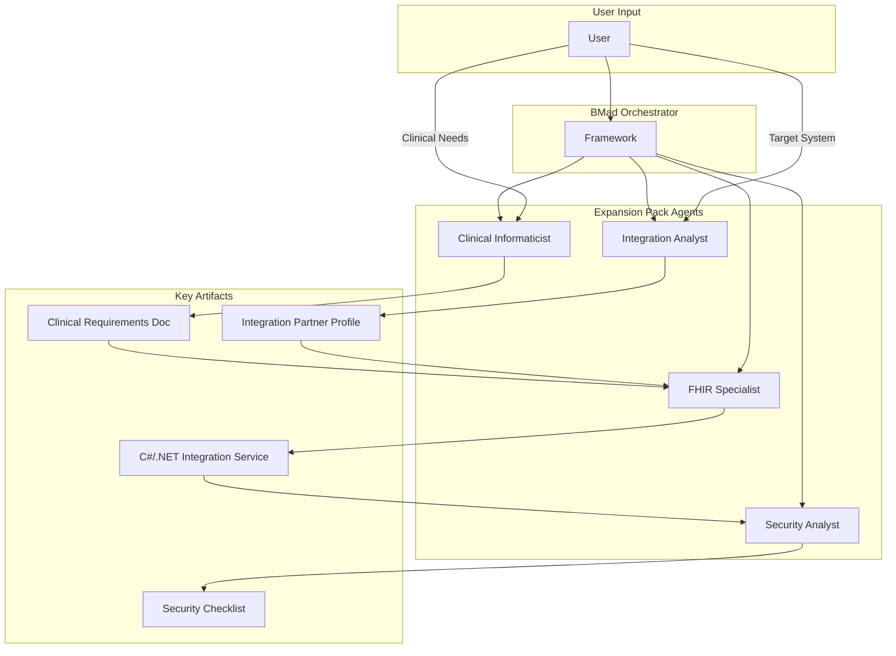

# Section 5 of 12: Components

This section breaks down the expansion pack into its primary logical components. The core components are the specialized AI agents themselves, each with a distinct set of responsibilities and interfaces (tasks).

## Component: FHIR Interoperability Specialist Agent

- **Responsibility:** The technical implementation of FHIR standards. This agent translates clinical requirements and vendor specifications into compliant FHIR artifacts and functional C#/.NET code.
- **Key Interfaces:** `generate-scaffolding`, `implement-data-mapping`, `implement-api-endpoint`, `create-validation-suite`.
- **Dependencies:** Consumes `clinical-requirements.md` from the Informaticist and the Integration Partner Profile from the Integration Analyst.

## Component: Clinical Informaticist Agent

- **Responsibility:** Serving as the clinical subject matter expert. This agent translates healthcare needs and data context into formal technical requirements.
- **Key Interfaces:** `document-clinical-requirements`, `review-simplifier-profile`.
- **Dependencies:** Consumes direct input from the user regarding clinical needs.

## Component: Healthcare IT Security and Compliance Analyst Agent

- **Responsibility:** Ensuring the integration meets all regulatory (e.g., HIPAA) and security standards.
- **Key Interfaces:** `conduct-security-assessment`.
- **Dependencies:** Consumes the completed and implemented integration service for its review.

## Component: Healthcare System Integration Analyst Agent

- **Responsibility:** Researching and documenting the technical specifics of target vendor systems.
- **Key Interfaces:** `initial-scoping`, `technical-research`, `document-quirks`.
- **Dependencies:** Consumes user input (target system) and external vendor documentation.

## Component Interaction Diagram

---
