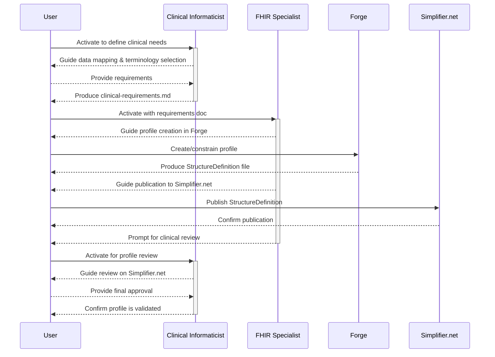
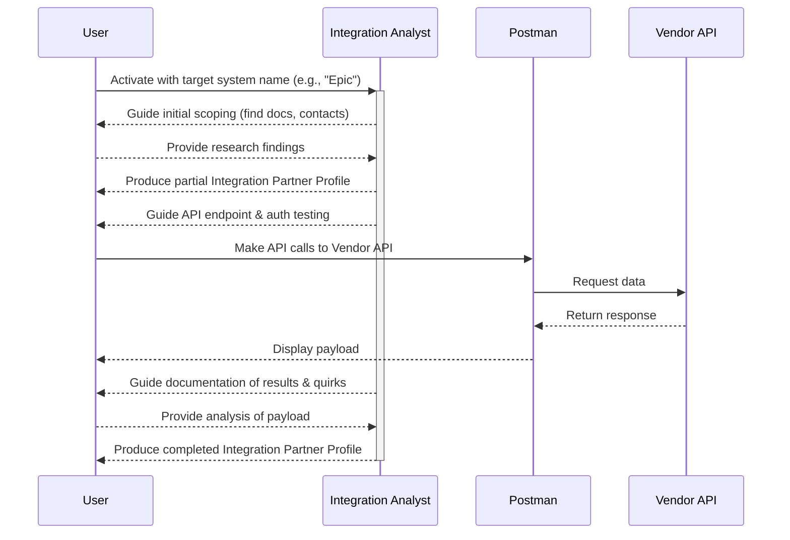
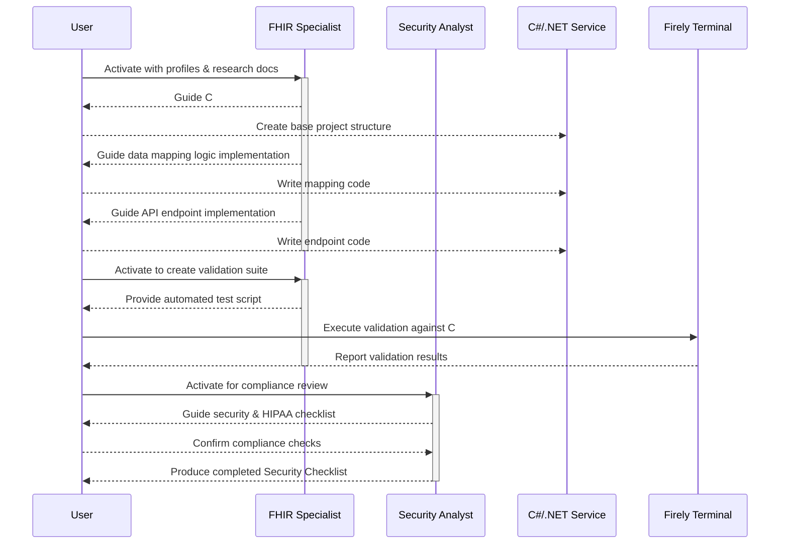

# Section 7 of 12: Core Workflows

This section visualizes the primary operational sequences of the expansion pack using Mermaid sequence diagrams. These diagrams illustrate the step-by-step collaboration between the user and the specialized AI agents to achieve the project's key objectives.

## Workflow 1: Specification & Profiling

This workflow details the process of creating a new, clinically validated FHIR profile.

## Workflow 2: Integration Research

This workflow shows how the Integration Analyst researches a target vendor system.

## Workflow 3: Development and Validation

This workflow visualizes the end-to-end process of generating, implementing, and validating the integration service code.

---
