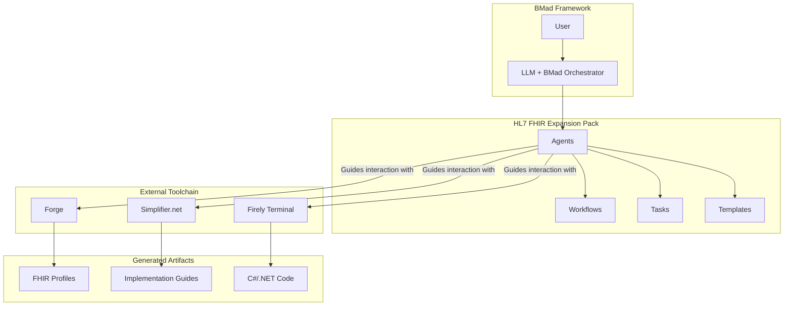

# Section 2 of 12: High Level Architecture

## Technical Summary

The HL7 FHIR Integration Expansion Pack is architected as a standard BMad file-based system, comprising a suite of specialized AI agents, workflows, tasks, and templates defined in Markdown and YAML. Its core function is to orchestrate the Firely toolchain and guide the generation of C#/.NET integration code. The architecture follows the BMad agent-driven pattern, where each AI persona encapsulates specific domain expertise. This component-based approach directly supports the PRD's primary goal of accelerating healthcare integration by providing a structured, automated framework for developers.

## High Level Overview

- **Architectural Style:** This is a BMad Standard File-Based Architecture. It is not a runnable application itself, but a collection of configuration files that give "life" to AI agents within the BMad framework.
- **Repository Structure:** As defined in the PRD, this will be a Monorepo. This structure is ideal for managing the interconnected components (agents, tasks, templates) of an expansion pack.
- **Interaction Flow:** A user will interact with a BMad-enabled LLM, load the expansion pack, and activate one of the specialized agents. The agent will then use its defined workflows, tasks, and templates to guide the user through a specific process, such as creating a FHIR profile or researching a vendor's API.

## High Level Project Diagram

## Architectural and Design Patterns

- **Agent-Based Architecture:** The core of the solution. This pattern allows us to encapsulate complex, domain-specific knowledge into manageable, reusable AI personas (e.g., Clinical Informaticist).  
  *Rationale:* Mirrors a real-world expert team, making the user's interaction intuitive.
- **Workflow Pattern:** The primary execution model for agents. Workflows define the step-by-step process for complex goals like "Specification & Profiling."  
  *Rationale:* Provides a structured, repeatable process that reduces errors and cognitive load for the developer.
- **Template Method Pattern:** The use of `.tmpl` files for generating standardized documents and code.  
  *Rationale:* Ensures consistency, enforces best practices, and automates the creation of repetitive artifacts like FHIR profiles and security policies.

---
